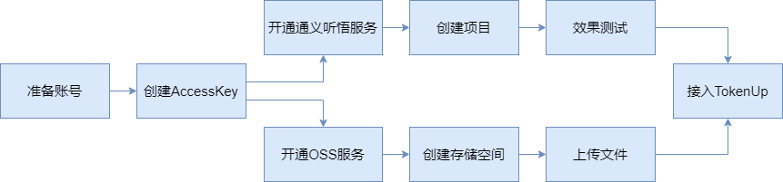

# 配置文件介绍
TokenUp配置参数介绍

**TokenUp** 使用 `dynaconf` 库进行环境变量管理。在本地部署项目时，
请在 `tokenup/.secrets.toml` 文件中配置您的环境变量，以确保项目正常运行。
以下是需要设置的环境变量的具体介绍。

## 密钥配置文件
```toml
[aliyun-oss]
access_key_id = 'your id here'
access_key_secret = 'your key here'
endpoint = 'https://oss-cn-shenzhen.aliyuncs.com'
bucket_name = 'bucket-feishu'

[tongyi-tingwu]
# 和阿里的配置一样
access_key_id = 'your id here'
access_key_secret = 'your key here'
AppKey = "your app key here"

[dify-secret]
dify_workflow_api = "xxx"
```
## 端口配置文件 settings.toml
```toml
[dify]
base_url = "https://api.hackathon.difyai.com/v1"
workflow_url ="https://api.hackathon.difyai.com/v1/workflows/run"
```

### 阿里云
在本项目中我们使用到了阿里云中的对象存储和通义听悟服务，配置概览图如下所示：

#### 对象存储服务 OSS
在本项目中，OSS服务主要用于多模态素材（包括视频和图片）的云端存储管理。开始使用OSS服务之前，
建议先熟悉其存储类型和计费模式，以便选择最适合需求的OSS配置。明确需求后，可按照控制台的快速入门指南
逐步完成设置和配置，从而高效地利用OSS服务，确保满足业务和成本效益要求。

需要查阅的链接：
- [OSS概览](https://help.aliyun.com/zh/tingwu/?spm=a2c4g.11186623.0.0.73702126PaO2Jr)
- [OSS控制台快速入门](https://help.aliyun.com/zh/tingwu/getting-started-1?spm=a2c4g.11186623.0.0.7ce66b63AXEJcs)

需要的配置参数：
access_key_id、access_key_secret、endpoint、bucket_name

#### 通义听悟服务
在本项目中，通义听悟服务主要用于视频语音的逐字提取。在开通通义听悟服务之前，建议先查看产品计费。然后，按照控制台的快速入门指南逐步完成设置和配置。

需要查阅的链接：
- 通义听悟概览：工作学习 AI 助手通义听悟-阿里云帮助中心
- 通义听悟快速入门：快速入门_工作学习 AI 助手通义听悟(TINGWU)-阿里云帮助中心

需要的配置参数：
access_key_id、access_key_secret、AppKey

#### Moonshot AI
在本项目中，我们使用Moonshot AI的moonshot-v1-128k模型，进行视频语音的子话题划分、视频总结以及问答对的拆分。建议你阅读Moonshot AI使用手册中的【速率限制、Token、模型列表】部分，以便选择最适合您需求的模型。

需要查阅的链接：
- [Moonshot AI 开放平台](https://platform.moonshot.cn/docs/intro#%E4%B8%BB%E8%A6%81%E6%A6%82%E5%BF%B5)

需要的配置参数：
api_key